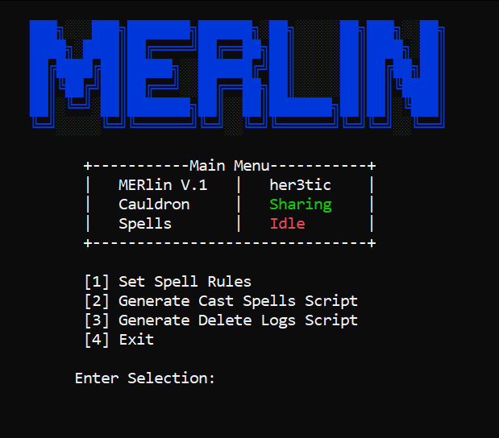

# MERlin

MERlin is a simple Python tool that allows you to quickly gather Event logs from workstations on a Domain.

This tool must be run as Admin on Domain Controller.

USAGE: 'python MERlin.py'

Logs will be deposited into \\machinename\Cauldron\ and C:\\Cauldron

